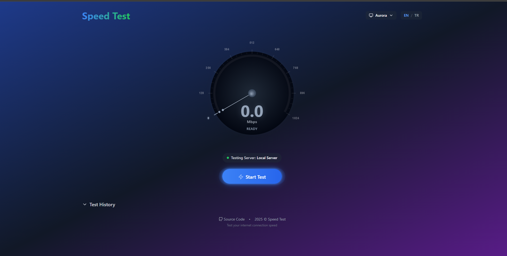
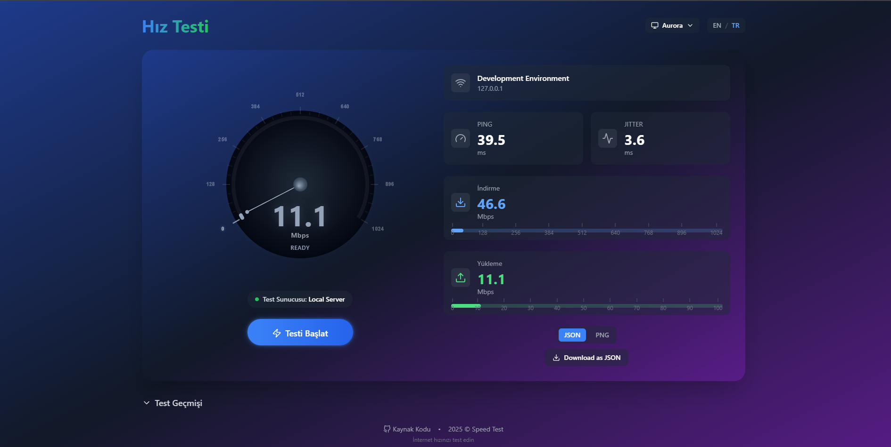
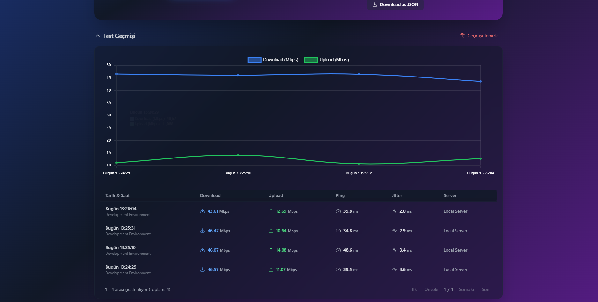

# Speed Test Application

A modern and user-friendly internet speed test application built with Next.js. Test your internet connection speed including download, upload, ping, and jitter measurements.

## Screenshots

<div align="center">
  
  <br/><br/>
  
  <br/><br/>
  
</div>

## Features

- 🚀 Real-time speed measurements
- 📊 Download speeds up to 1024 Mbps
- 📤 Upload speeds up to 100 Mbps
- 📍 Server location detection
- 📱 Responsive design
- 🌍 Multi-language support (English/Turkish)
- 🎨 Theme options (Aurora/Dark/Dim)
- 📜 Test history with up to 100 records
- 💾 Export results as JSON or PNG
- 🎯 Accurate ping and jitter measurements

## Technologies Used

- Next.js 14
- TypeScript
- Tailwind CSS
- Chart.js
- HTML-to-Image

## Getting Started

1. Clone the repository:
```bash
git clone https://github.com/gorkembayraktar/speedtest.git
```

2. Install dependencies:
```bash
npm install
```

3. Run the development server:
```bash
npm run dev
```

4. Open [http://localhost:3000](http://localhost:3000) in your browser.

## Theme Options

The application offers three beautiful themes:

- **Aurora**: Default theme with a modern gradient look
- **Dark**: Classic dark theme for low-light environments
- **Dim**: Balanced dark theme with softer contrasts

Theme preferences are automatically saved in your browser and will persist between sessions.

## Live Demo

Visit [https://speedtest-gb.vercel.app](https://speedtest-gb.vercel.app) to see the application in action.

## License

This project is licensed under the MIT License - see the [LICENSE](LICENSE) file for details.

---

# Hız Testi Uygulaması

Next.js ile geliştirilmiş modern ve kullanıcı dostu bir internet hız testi uygulaması. İndirme, yükleme, ping ve jitter ölçümlerini test edin.

## Ekran Görüntüleri

<div align="center">
  
  <br/><br/>
  
  <br/><br/>
  
</div>

## Özellikler

- 🚀 Gerçek zamanlı hız ölçümleri
- 📊 1024 Mbps'ye kadar indirme hızı
- 📤 100 Mbps'ye kadar yükleme hızı
- 📍 Sunucu konumu tespiti
- 📱 Responsive tasarım
- 🌍 Çoklu dil desteği (İngilizce/Türkçe)
- 🎨 Tema seçenekleri (Aurora/Koyu/Loş)
- 📜 100 kayıta kadar test geçmişi
- 💾 JSON veya PNG olarak sonuç dışa aktarma
- 🎯 Hassas ping ve jitter ölçümleri

## Kullanılan Teknolojiler

- Next.js 14
- TypeScript
- Tailwind CSS
- Chart.js
- HTML-to-Image

## Başlangıç

1. Repository'yi klonlayın:
```bash
git clone https://github.com/gorkembayraktar/speedtest.git
```

2. Bağımlılıkları yükleyin:
```bash
npm install
```

3. Geliştirme sunucusunu başlatın:
```bash
npm run dev
```

4. Tarayıcınızda [http://localhost:3000](http://localhost:3000) adresini açın.

## Tema Seçenekleri

Uygulama üç güzel tema seçeneği sunar:

- **Aurora**: Modern gradyan görünümlü varsayılan tema
- **Koyu**: Düşük ışıklı ortamlar için klasik koyu tema
- **Loş**: Yumuşak kontrastlı dengeli koyu tema

Tema tercihleri tarayıcınızda otomatik olarak kaydedilir ve oturumlar arasında korunur.

## Canlı Demo

Uygulamayı görmek için [https://speedtest-gb.vercel.app](https://speedtest-gb.vercel.app) adresini ziyaret edin.

## Lisans

Bu proje MIT Lisansı ile lisanslanmıştır - detaylar için [LICENSE](LICENSE) dosyasına bakın. 